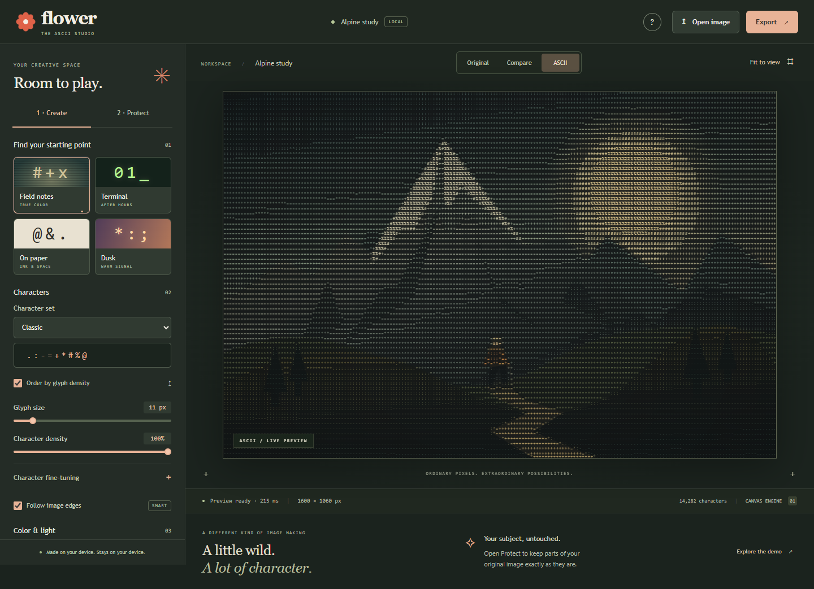

<p align="center"></p>

<h1 align="center">Flower</h1>
<p align="center"><strong>A little wild. A lot of character.</strong><br>A private, open-source creative studio for turning photographs into ASCII art.</p>

<p align="center"><a href="https://philppplik.github.io/flower/">Website</a> · <a href="https://philppplik.github.io/flower/studio.html">Open the studio</a> · <a href="https://github.com/philppplik/flower/releases">Download</a> · <a href="docs/INSTALLATION.md">Installation</a></p>

[](https://github.com/philppplik/flower/actions/workflows/verify-and-publish.yml)
[](LICENSE)
[](https://nodejs.org/)



## What is Flower?

Flower turns image regions into characters with precise, repeatable controls. Paint a mask to preserve your subject's original pixels, adjust the surrounding character art, and export the result. Its renderer is deterministic; it does not generate a replacement photograph.

Start immediately in the [browser studio](https://philppplik.github.io/flower/studio.html), or run the same editor locally. Manual editing requires no account, API key, package installation, or remote image processing. The optional local AI model adds automatic foreground selection.

## Create your first image

1. Open an image or use the included sample. A short welcome tour is available on first visit and from Help.
2. Pick a look, then adjust character size, density, color, and light. Advanced controls expand when you need them.
3. Optionally open **Protect** and paint over the parts you want to keep. Compare original and result with the draggable divider.
4. Export a PNG, JPEG, WebP, SVG, or plain-text grid.

## Features

| Creative control | What you can do |
| --- | --- |
| Characters | Classic, Cyber, Minimal, Binary, Letters, or custom Unicode; measured glyph-density ordering, spacing, size, rotation, edge-aware selection |
| Looks | Four presets, original/mono/gradient/quantized color, contrast, gamma, saturation, glow, scanlines, grain, vignette |
| Protection | Brush, erase, rectangle, connected color region, invert, expand/contract, feather, undo/redo, mask import/export |
| Compositing | Preserve selected pixels, affect only selected pixels, or process the full image; independent opacity controls |
| Workflow | Live worker-based analysis, original/split/result views, keyboard shortcuts, portable JSON looks, guided onboarding |
| Output | Original-resolution raster, editable SVG text, plain TXT; 0.5×, 1×, or 2× scale within memory limits |
| Local AI | Optional cached U²-Net foreground selection; fully separate from the renderer |

## Run locally

Requires **Node.js 22 or newer**.

```sh
git clone https://github.com/philppplik/flower.git
cd flower
node server.mjs
```

Open **http://127.0.0.1:5173/studio.html**. On Windows, you can double-click **Start Flower.cmd**. No `npm install` is needed for normal editing.

For downloads without Git, extract the source ZIP from [Releases](https://github.com/philppplik/flower/releases) and run the same command. See [Installation](docs/INSTALLATION.md) for Windows/macOS/Linux instructions, optional AI setup, configuration and troubleshooting.

## Development and tests

The application has **zero runtime JavaScript dependencies**. Playwright is a development-only dependency.

```sh
npm ci
npm run check
npm test
npx playwright install chromium
npm run test:browser
node scripts/pages-test.mjs
```

Unit tests cover deterministic analysis, original-pixel/alpha preservation, mask algorithms, history, preset validation, SVG escaping, onboarding persistence and positioning, and server boundaries. Browser tests exercise the landing page, the complete desktop/mobile tour, masking, uploads, comparison and all five exports. The Pages test verifies the real `/flower/` subpath build and confirms it makes no local API requests.

`npm run test:ai` validates the real local model adapter after installation and model caching. CI does not download model weights. See [VALIDATION.md](VALIDATION.md) for tested environments and limits.

## Architecture

The same pure analysis engine powers the landing specimens and the studio. AI only produces a selection mask; the renderer decides how pixels become characters.

```text
Image → cell analysis → glyph/color selection → Canvas or SVG
                                               ↓
Manual tools or local AI → mask → original-pixel compositing → export
```

`src/core/` contains browser-independent algorithms. `src/worker.js` runs analysis away from the UI thread. `src/render.js` handles raster drawing; `src/app.js` coordinates editing; `src/onboarding.js` manages the tour. `server.mjs` serves local assets and bridges the optional `python/segment.py` adapter. `scripts/build-pages.mjs` publishes only allowlisted browser files.

## Privacy and limits

- Browser editing and export stay on your device. The hosted site has no analytics, tracking scripts, remote fonts, or image-upload service.
- Local AI sends the image only to your own loopback server. It downloads a model once, then uses the cache.
- Only tour completion is persisted locally. Editing sessions are in memory: export your output, mask and look before closing the page.
- Inputs: up to 12 MP, 6,000 px per side, and 30 MB. Exports: up to 24 MP and 10,000 px per side.
- Fully protected pixels in a 1× PNG export are preserved from the decoded original. Resizing, JPEG compression, and feathered edges intentionally change pixels.
- SVG contains editable glyphs plus embedded raster content where needed. Glow/fonts can render differently across applications; film grain is raster-only.
- This release covers still images. Depth estimation, video tracking, named multi-object detection and GPU/batch processing are not included.

More details: [Reference](docs/REFERENCE.md) · [Design decisions](docs/DESIGN.md) · [Security policy](SECURITY.md).

## Contributing and license

Read [CONTRIBUTING.md](CONTRIBUTING.md) for development conventions, tests, and pull requests. Bug and feature templates are available under [Issues](https://github.com/philppplik/flower/issues). Maintainers can follow the [release guide](docs/RELEASING.md).

**MIT License © 2026 Philipp Paulik.** See [LICENSE](LICENSE). Bundled Flower artwork is included under the same license. Third-party Python packages and model weights retain their respective licenses. Design references were studied through [Inspo MCP](https://inspomcp.dev/); no third-party design assets are redistributed.
